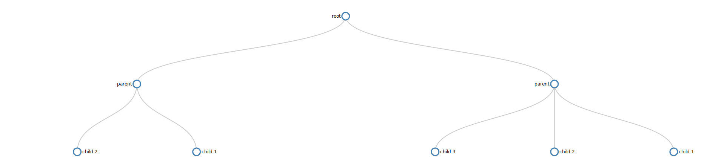

# markdown-tree-viewer

This is a naive converter program that takes a markdown like text file containing a tree definition and converts it to JSON so that it can be (manipulated by javascript or other templates) for viewing in the browser.

Represent nodes like this:

```
root
-parent
--child 1
--child 2
--child 3
-parent
--child 1
--child 2

```
And get this as a result:




## Usage

1. Download the script.
2. There are three ways to run this program.

     `$ python tree-gen.py -n x -l y`.
     Generate an input file for a tree with **x** nodes and a maximum of **y** levels.
     
     `$ python tree-gen.py -n x -l y -g`.
     Generate an input file for a tree with **x** nodes and a maximum of **y** levels and then generate the corresponding output JSON file so that the tree is viewable in the browser.
     
     `$ python tree-gen.py -g`.
     Take the input file and generate the corresponding output JSON file so that it is viewable in the browser. Use this option when you have written your own tree.
     

## Requirements & Examples

* In this program, by definition, a tree must have a root node. A root node has a level of 0 in a tree. The root node must come first in the input file.
* Every node must go on a new line.
* Levels are defined with the `-` (dash) symbol. A node with no dash indicates the root node, which there can only be one of.
* A child of the root node has a level of 1.

Here is an example input file.

```
root
-child

```

If `$ python tree-gen.py -g` is run when this content resides in the input file, an output file is produced. The output file contains this data in JSON form which the browser can easily read.

Afterwards, opening the included index.html file in a browser grabs the output.json file and would display this:


Here is another example input file.

```
root
-parent A
--child of parent A
-parent B
--child 1 of parent B
--child 2 of parent B
---child of child 2 and grandchild of parent B

```

Running `$ python tree-gen.py -g` when this content resides in the input file would display this in the browser:


## To Do

Several tests for unexpected behavior

